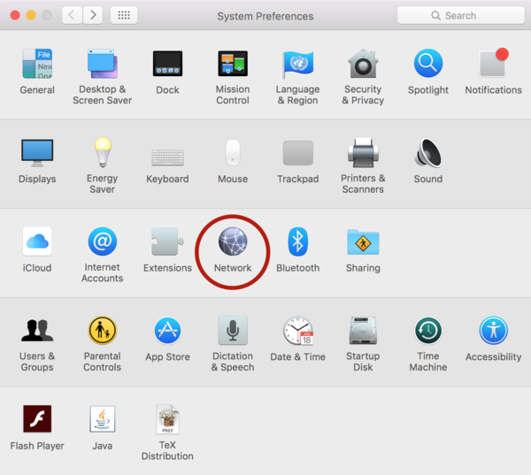
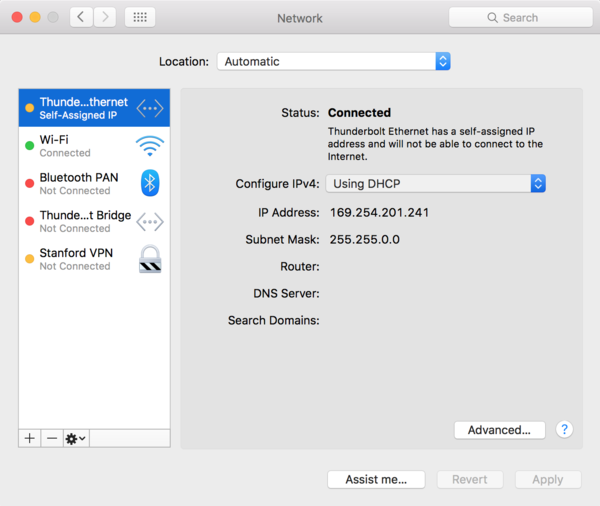
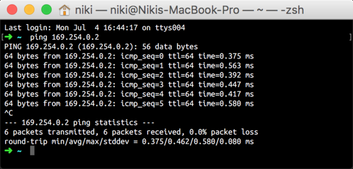
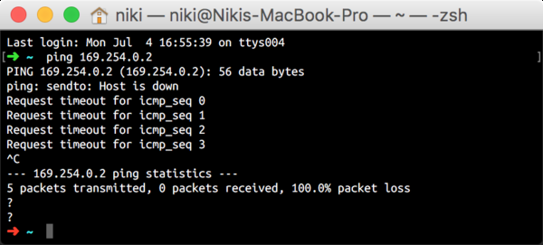
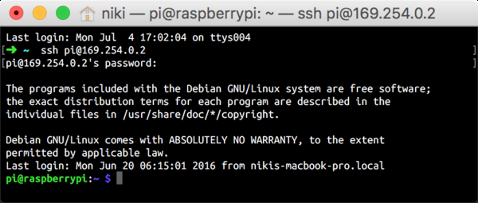
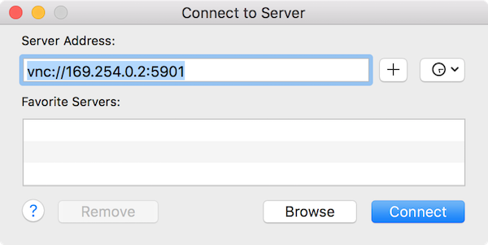
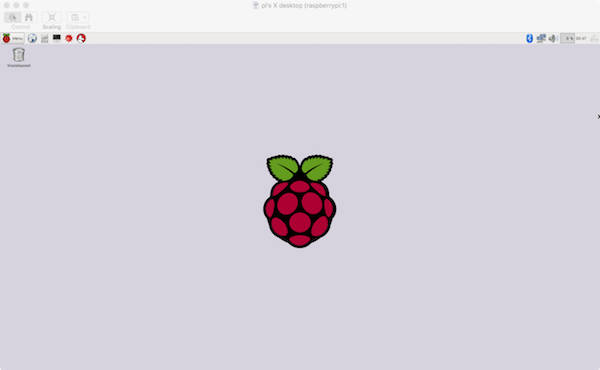

# Working with the Raspberry Pi

This is a brief introductory tutorial on how to work with the Raspberry Pi. If
not mentioned otherwise, the material here is valid for all models of the
Raspberry Pi. Some Raspberry Pi 3 specific topics will be marked as such.


**Table of Contents**

* [Overview](#overview)
* [Setup the Operating System Image](#setup-the-operating-system-image)
* [The RPi as a Regular Computer](#the-rpi-as-a-regular-computer)
* [Remote Control -- The RPi as an Embedded Device](#remote-control---the-rpi-as-an-embedded-device)
  - [Assigning an IP address](#assigning-an-ip-address)
  - [Connecting via SSH](#connecting-via-ssh)
    + [Linux](#linux)
    + [Windows](#windows)
    + [MacOS](#macos)
* [Installing NodeJS](#installing-nodejs)
* [A First JavaScript Program](#a-first-javascript-program)
* [Some JavaScript Examples](#some-javascript-examples)
  - [HTTP](#http)
  - [HTTPS](#https)
  - [Audio via Headphone Jack](#audio-via-headphone-jack)
* [Making Use of the GPIO Pins](#making-use-of-the-gpio-pins)
* [Virtual Network Computing](#virtual-network-computing)
* [References](#references)

## Overview

In contrast to a regular computer the Raspberry Pi (*RPi*) does not have a built-in hard drive or SSD. Therefore we need to provide the operating system (*OS*) and all persistent data as an image on an SD card. In the first four sections of this tutorial we will see how to build such an image, get the RPi running and connect it to a computer so we can control it.

Once we can access the RPi remotely, we will install *NodeJS* and write some JavaScript to verify that NodeJS is working correctly. This enables us to install *raspio* and *johnny-five* via *npm* to take control over the RPi's GPIO pins. Besides a classic LED-blinking tutorial, the *hello world* of embedded devices and some audio streaming, we will also turn towards some more specialized capabilities of the RPi 3 and send out HTTP(S) requests via WiFi.

>:information_source: For the study group we will provide SD cards with pre-built images that already contain the software stack for various tasks. If you are not planning to setup a RPi yourself, you can thus skip sections [Setup the Operating System Image](#setup-the-operating-system-image) and [The RPi as a Regular Computer](#the-rpi-as-a-regular-computer) and go straight to [Connecting via SSH](#connecting-via-ssh).

## Setup the Operating System Image

First, we will install the Raspbian operating system for the Raspberry Pi. You can download the zip file from [here](https://www.raspberrypi.org/downloads/raspbian/). The official Raspberry Pi homepage also provides an [excellent installation guide](https://www.raspberrypi.org/documentation/installation/installing-images/README.md) for Linux, MacOS and Windows.


>:information_source: We will stick to the plain foundation's officially supported OS Raspbian as opposed to others. While installing Rapsbian as described above should not pose any problems, it might be even easier for beginners to start out with NOOBS (which contains Raspbian).

Now we should have a (micro) SD card with the Raspbian image that we can insert into the RPi's card slot and are ready to go. Of course, to make use of the RPi we need some input and output capabilities. The first way is to operate the RPi more or less like a regular computer.

## The RPi as a Regular Computer

The RPi comes equipped with plentiful interfaces precisely for this mode of operation. For example, all models have an HDMI and at least two USB ports. Simply connect a keyboard and a mouse via USB as well as a montior via HDMI before you connect the RPi to the power supply. As soon as you provide power via the micro USB port, the RPi will boot up. It can now be used just like a regular computer. The RPi will recognize most of the common keyboards and mice during the boot process. If you have worked on a Linux machine before everything will be familiar, as Raspbian is based on Debian.

While this is a very convenient and intuitive way to interact with the RPi, it is not the approach we want to take here. Thus we are not going into more detail at this point. Typical use cases for the RPi do not involve it being hooked up to a monitor, keyboard and mouse all the time. We want to operate it as a standalone embedded device, but still be able to control it remotely. Let us discuss this mode of operation in the next section.

>:exclamation: Make sure that the power supply delivers sufficient current for your model. Of course, the power requirements depend heavily on the model, the peripherals and the task. The official homepage recommends the following specifications

| Product   | Recommended | Max. USB Draw | Bare-Board |
| --------- | ----------- | ------------- | ---------- |
| Model A   | 700mA       | 500mA         | 200mA      |
| Model B   | 1.2A        | 500mA         | 500mA      |
| Model A+  | 700mA       | 500mA         | 180mA      |
| Model B+  | 1.8A        | 600mA/1.2A    | 330mA      |
| 2 Model B | 1.8A        | 600mA/1.2A    |            |
| 3 Model B | 2.5A        | 1.2A          | ~400mA     |

## Remote Control - The RPi as an Embedded Device

To communicate with the RPi remotely we first need a connection. We will establish this connection via a physical Ethernet cable. In terms of network protocols prehaps _the_ standard way to login on a machine remotely is `ssh` (**S**ecure **Sh**ell).

### Assigning an IP address

Many online tutorials on remote access of the RPi assume that the the RPi is already connected to the internet or that we know it's IP address in the local network which apparently requires some configuration. Because start from scratch with an RPi that was never hooked up to a monitor and keyboard for prior configuration, we have to initialize all necessary settings right in the image on the SD card.

To this end put the SD card back into your computer and navigate to the root directory. There is a file named `cmdline.txt`. Open this file in your favorite editor, it should read something like

```
dwc_otg.lpm_enable=0 console=serial0,115200 console=tty1 root=/dev/mmcblk0p2 rootfstype=ext4 elevator=deadline fsck.repair=yes rootwait
```

Do not worry if it is not exactly the same, this is just for illustration purposes. This file contains some commands that will be called upon start up of Raspbian. This allows us to perform configurations. Specifically we will assign a unique IP adress to the RPi. Therefore, at the end of the last line in `cmdline.txt` add `ip=169.254.0.XXX`, where `XXX` is some number that should be unique in the network, in particular this should differ from the IP address of your computer. The whole `cmdline.txt` should then read for example

```
dwc_otg.lpm_enable=0 console=serial0,115200 console=tty1 root=/dev/mmcblk0p2 rootfstype=ext4 elevator=deadline fsck.repair=yes rootwait ip=169.254.0.2
```

>:exclamation: Be careful not the add or remove any empty lines.

You can now eject the SD card and put it back into the RPi.

>:information_source: If you encounter any problems in this step, check out [this tutorial](https://pihw.wordpress.com/guides/direct-network-connection/) for a more detailed description.

### Connecting via SSH

Before connecting the RPi to the computer make sure that you are using the Dynamic Host Configuration Protocol (DHCP), i.e., the computer automatically provides and assigns an IP adress for connections via the Ethernet port.

#### Linux

TODO

#### Windows

TODO

#### MacOS

Open the _System Preferences_



then click on _Network_



and make sure that _Using DHCP_ is selected from the drop down menu.

Once this is set up and the SD card is back in the RPi's card slot, connect an Ethernet cable to both your computer and the RPi's Ethernet port. Then connect the RPi to a power supply via the micro USB port. Now we have to wait a little bit for the RPi to boot. (The Ethernet port is _hot-plugging_ capable, i.e., you can connect and disconnect it at any time and it should still work.)

The only platform independent indicator whether everything is working is to try it out. Hence, our next step is to open up a terminal aka. console aka. shell and type

```shell
ping 169.254.0.XXX
```

where `XXX` is to be replaced with the number you chose [above](#assigning-an-ip-address). Ideally the output will look like the following screenshot.



You can abort the ping command just like any other command typically with `CTRL + c` (or also `COMMAND + .` on MacOS). If the `ping` test does not work you should wait a couple seconds and try it again. Chances are the RPi has not yet booted and configured the network settings.

If even after multiple tries you see output like in the screenshot below, something went wrong. In that case we recommend checking your computer's network setting (make sure DHCP is enabled) and carefully go through the instructions again.



Now that the RPi responded to our `ping`, we are confident that the connection is established and we can type

```shell
ssh pi@169.254.0.XXX
```

Remember to replace `XXX` with the chosen number. Upon request type in the password

```shell
raspberry
```

and confirm with the Enter key.

>:exclamation: The default username of a fresh Raspbian installation is `pi` and the default password is `raspberry`.

You should see a short legal disclaimer and the command line prompt should turn into `pi@raspberrypi` like in the screenshot below.



Now we have full control over the Raspberry Pi.

## Installing NodeJS

>:exclamation: In this section we assume that the Raspberry Pi has a working connection to the internet. Hence it applies to the Raspberry Pi 3 and/or previous models equipped with a functioning WiFi shield. During the study group you will receive images with NodeJS pre-installed so you can skip this section and continue with [A First JavaScript Program](#a-first-javascript-program).

[NodeJS](https://nodejs.org/)® is a JavaScript runtime built on Chrome's V8 JavaScript engine. JavaScript is one of the three core technologies for most of the content production on the internet and as such typically executed by browsers. NodeJS allows us to execute JavaScript code outside of a browser from the command line.

On Raspbian we have access to the Linux' **A**dvanced **P**ackage **M**anager (APT). Raspbian actually already comes with NodeJS installed, but it is an old version. You can check this by typing the following in the terminal while you are connected to the RPi

```shell
nodejs -v
```

To install a newer version, we first remove the old version and certain tools that depend or build on it, e.g., Node-Red and NPM. For the whole workflow enter all these commands one after the other.

```shell
sudo apt-get remove nodered -y
sudo apt-get remove nodejs nodejs-legacy -y
sudo apt-get remove npm -y # if npm has been installed previously
sudo curl -sL https://deb.nodesource.com/setup_5.x | sudo bash -
sudo apt-get install nodejs -y
```

We can check whether the installation was successful with

```shell
nodejs -v
npm -v
```

The first command should output `v5.11.1` (we only care about the 5 in the beginning) and the second should give something close to `3.8.6`. You can also choose even newer versions of NodeJS by adjusting the link in the `curl` command above. For example, you could replace `setup_5.x` by `setup_6.x`.

## A First JavaScript Program

After all the preparation we can finally write our own code and run it on the RPi. The classic _hello world_ turns into a one-liner in JavaScript. Simply create a file, for example `hello.js`, containing only

```js
console.log('Hello World');
```

We can now run this program from the command line with

```sh
node hello.js
```

As simple as that. We can now leverage the full power of JavaScript (EcmaScript 6) and NodeJS. If you are already familiar with JavaScript but have not used NodeJS, the #[documentation](https://nodejs.org/api/documentation.html) will certainly be useful.

## Some JavaScript Examples

>:exclamation: For the first two examples in this section the Raspberry Pi needs to be connected to the internet. For the third example one only needs internet connection to install the necessary packages. (We will provide SD cards with images that already have the necessary packages installed.)

### HTTP

Let's do another more interesting example. In the #[CC3200 tutorial](https://github.com/greeniot/CC3200-Sample) we have shown how to send a HTTP(S) request as well as receive the answer and analyze the results. What took quite some time and many lines of C(++) code can now be done effortlessly in fewer than ten self-explanatory lines:

```js
var http = require('http');

http.get('http://httpbin.org/bytes/4', (res) => {
    var str = '';
    res.on('data', (chunk) => {str += chunk;});
    res.on('end', () => {console.log(str);});
}).on('error', (e) => {console.log(`error: ${e.message}`);});
```

Here we query #[httpbin.org](http://httpbin.org/) for four random bytes. Therefore the output of this program is 4 random symbols. Note that some bytes represent non-printable symbols.

### HTTPS

While a HTTPS request required much more effort compared to HTTP on the CC3200 Launchpad, NodeJS now does all the heavy lifting for us. We can basically replace each occurrance of `http` with `https` in the code sample above. In the following example we query #[random.org](https://www.random.org/) for a uniformly distributed random integer from 1 to 100. We also output some meta data about the request, which gives us some insight into what is actually going on behind the scenes.

```js
var https = require('https');

https.get('https://www.random.org/integers/?num=1&min=1&max=100&col=1&base=10&format=plain&rnd=new',
(res) => {
    console.log('headers: ', res.headers);
    var str = '';
    res.on('data', (chunk) => {str += chunk;});
    res.on('end', () => {console.log(str);});
}).on('error', (e) => {console.error(`error: ${e.message}`);});
```


### Audio via Headphone Jack

Finally, let's try to make use of the RPi's 3.5mm headphone jack. Before we can stream music to the headphone jack via JavaScript we need to install some packages.

>:exclamation: This step requires a working internet connection. (We will provide SD cards with images that already have the necessary packages installed.)

```sh
sudo apt-get install libasound2-dev
npm install --save speaker lame
```

Next we need an audio file that we want to play. To this end open another terminal on your computer (no ssh connection). Navigate to the directory with the desired audio file, e.g., `megahit.mp3`. We will use _save copy_ to copy the audio file to the Raspberry Pi:

```sh
scp megahit.mp3 pi@169.254.0.XXX:/Music/
```

Again, recall that `XXX` has to be replaced by the correct number you assigned to the RPi.

The JavaScript code itself is again pretty short and self-explanatory:

```js
var fs = require('fs');
var lame = require('lame');
var Speaker = require('speaker');

fs.createReadStream('/home/pi/Music/megahit.mp3')
    .pipe(new lame.Decoder())
    .on('format', function (format) {this.pipe(new Speaker(format));})
    .on('error', (e) => {console.error(`error: ${e.message}`);});
```

## Making Use of the GPIO Pins

Everything we did so far, we could have run on any machine with NodeJS and the necessary packages installed. Now we want to actually use the RPi as an embedded device by accessing its GPIO pins.

First we need to install the necessary libraries. The `raspi-io` library handles the low level control of the GPIO pins while `johnny-five` allows for a simple high level workflow.

>:exclamation: This step requires a working internet connection. (We will provide SD cards with images that already have the necessary packages installed.)

```sh
npm install johnny-five raspi-io
```

We have finally come to the point where we can write our first _hello world of embedded devices_, the blinking LED. We simply follow the official example at [johnny-five](http://johnny-five.io/examples/raspi-io/).

```js
var five = require("johnny-five");
var raspi = require("raspi-io");
var board = new five.Board({
    io: new raspi()
});

board.on("ready", function() {
    var led = new five.Led("P1-13");
    led.blink();
});
```

You can learn more about the pin naming and functions in the [documentation of rasp-io](https://github.com/nebrius/raspi-io/) (in particular also [here](https://github.com/nebrius/raspi-io/wiki/Pin-Information)) and in the [examples section](http://johnny-five.io/examples/) of the johnny-five homepage. A very basic description of GPIO pins in general can be found on the official [Rapsberry Pi Homepage](https://www.raspberrypi.org/documentation/usage/gpio-plus-and-raspi2/README.md). From here on it is mostly a matter of reading documentations and tutorials as well as trial and error to create truly awesome applications.

## Virtual Network Computing

If at some point you feel that you really want to work with the graphical user interface of the Raspbian OS, but do not have a monitor, you can share the RPi's Desktop with your laptop via virtual network computing (VNC). This allows us to remotely control the desktop interface of the RPi. You'll see in a window on your laptop exactly what a monitor connected to the RPi would show. You can interact with the virtual desktop in the exact same way as if the mouse and keyboard where hooked up to the RPi.

We will use TightVNC.

>:exclamation: This step requires a working internet connection. (We will provide SD cards with images that already have the necessary packages installed.)

```sh
sudo apt-get install tightvncserver
```

If the installation finished successfully, we can launch a virtual server

```sh
tightvncserver
```

You will be asked to enter your a password and an optional view-only password. While anyone with the first password you enter can view and control the RPi remotely once you the VNC server runs on the RPi, the second password only provides view rights. That is like looking over someone's shoulder while they are using a Laptop. You can see everything that's going on, but you can't intervene.

Next we can start the VNC server. It takes several options which you can check out via `man vncserver`. A typical launch command would for example be

```sh
vncserver :1 -geometry 1920x1080 -depth 24
```

The `:1` specifies the so called display number. Note that the number `:0` is reserved by default, thus we should use a number greater than 0 for our display. The `-geometry` options determines the resolution, here we are displaying the desktop in full HD. Finally `-depth` specifies the color depth (must be between `8` and `32`).

As already mentioned there is always an X session running on display `:0`. To save ressources it is a good idea to shut down the display manager

```sh
service lightdm stop
```

The RPi is now ready. The VNC server is running and we can connect to it from our Laptop. The connection process depends on the operating system. Before we go into that, to quit the VNC server running on the RPi simply type

```sh
vncserver -kill :1
```

>:exclamation: When using the RPi via a VNC connection on your Laptop, do not use the logout button in the menu bar of the desktop. Simply quit the screen sharing/remote desktop viewer application running on your Laptop and subsequently kill the VNC server on the RPi as described above.

### Linux

It is likely that your Linux distribution already ships with a remote desktop viewer. Just search for a `Remote Desktop Viewer` application in the menu bar. When asked for the address or hostname of the VNC server, enter `vnc://169.254.0.XXX:5901`, where `XXX` needs to be replaced by the number you used for the IP adress of the RPi. The weird number `5901` is explained at the end of this section. You will be asked for a password, which is the first one you entered when setting up the VNC server on the RPi. Then the desktop of the Raspberry should pop up in its own window.

If your distribution does not contain a remote desktop viewer, you can install TightVNC just like we did on the RPi. Note that while we installed `tightvncserver` on the RPi we now just want a viewer. So on your computer (*not the RPi*) type

```sh
sudo apt-get install xtightvncviewer
```

To connect to the running session on the RPi simply type

```sh
vncviewer 169.254.0.XXX:5901
```

Again, you might have to replace `5901` by `1` or `5501` and `XXX` by the number you used for the RPi's IP adress.

### Windows

On Windows you can download a VNC viewer software (32 or 64 bit) from [tightvnc.com](http://www.tightvnc.com/). After installation, launch the `TightVNC viewer` from the start menu. You will be asked for an IP adress or hostname of the VNC server you want to connect to. Enter `169.254.0.XXX::5901`, where you need to replace `XXX` with the number you chose for the IP adress of the RPi. If that is not working, instead of `::5901` also try `:5901` or simply `:1`. The weird number `5901` is explained at the end of this section. Next, click `Connect` and you will be asked for a password, which is the first one you entered when setting up the VNC server on the RPi. Then the desktop of the Raspberry should pop up in its own window.

### MacOS

On MacOS you do not need any extra software. There is an inbuilt Screen Sharing app, which is located at `System/Library/CoreServices/Application/Screen Sharing.app`. You can also just search for Screen Sharing with Spotlight. When you launch the screen sharing app you will be asked to enter the hostname of the VNC server. Here we enter the IP Adress of the RPi followed by the number `5901`, see image below. The weird number `5901` is explained at the end of this section. You will be asked for a password, which is the first one you entered when setting up the VNC server on the RPi.


Alternatively, you can also just open Finder, click on *Go* in the menu bar and then *Connect to Server...* (or simply press `⌘K`). Then enter `vnc://169.254.0.XXX:5901` (replace `XXX` by the number you chose in the RPi's IP address), like in this screenshot



Either way the desktop of the Raspberry should pop up in a window like the one below



>:information_source: The last digit `1` in `5901` corresponds to the display number `:1` we specified on the RPi. The number `5900` is often used as the standard default port for VNC starting at 0. Hence to get to display `:1`, we add 1 to arrive at `5901`. If that does not work, you might also try just `:1` instead of `:5901`.

>:information_source: If you want the RPi to launch a VNC server on startup so that you can always connect with a VNC viewer right after it booted and for further information on setting up a VNC server on the RPi follow the [instructions here](https://www.raspberrypi.org/documentation/remote-access/vnc/README.md).

## References

* [Direct Connection Tutorial](https://pihw.wordpress.com/guides/direct-network-connection/)
* [Raspberry Pi Usage Examples](https://www.raspberrypi.org/documentation/usage/)
* [Raspberry Pi VNC Tutorial](https://www.raspberrypi.org/documentation/remote-access/vnc/README.md)
* [NodeJS Documentation](https://nodejs.org/api/documentation.html)
* [Johnny Five](http://johnny-five.io/)
* [TightVNC](http://www.tightvnc.com/)
* [WebOnDevices - JavaScript Electronics](http://www.webondevices.com/)