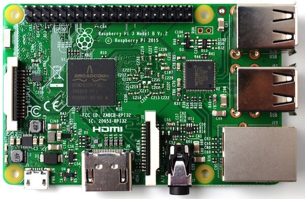

# Working with the Raspberry Pi

This is a brief introductory tutorial on how to work with the Raspberry Pi. If
not mentioned otherwise, the material here is valid for all models of the
Raspberry Pi. Some Raspberry Pi 3 specific topics will be marked as such.

## Overview

In contrast to a regular computer the Raspberry Pi (*RPi*) does not have a built in hard drive or SSD. Therefore we have to provide the operating system and all persistent data as an image on an SD card. In the first part of this tutorial we will see how to build such an image, get the RPi running and connect it to a computer so we can control it.

Once we can access the RPi remotely, we will install *NodeJS* and write some JavaScript to verify that NodeJS is working correctly. This enables us to install *raspio* and *johnny-five* via *npm* to take control over the RPi's GPIO pins. After a classic LED-blinking tutorial, we will turn towards some more specialized capabilities of the RPi 3 and send out HTTP(S) requests via WiFi.

**Note:** For the study group we will provide SD cards with prebuilt images that already contain the software stack for various tasks. If you are not planning to setup a RPi yourself, you can thus skip section TODO.

## Requirements

First, we will install the Raspbian operating system for the Raspberry Pi. You can download the zip file [https://www.raspberrypi.org/downloads/raspbian/](here). Raspberrypi.org also provides an [https://www.raspberrypi.org/documentation/installation/installing-images/README.md](excellent installation guide) for Linux, MacOS and Windows.

**Note:** In the study group we will to stick to the foundation's officially supported operating system Raspbian as opposed to NOOBS or others.

## Step-By-Step

## Conclusions

## References
